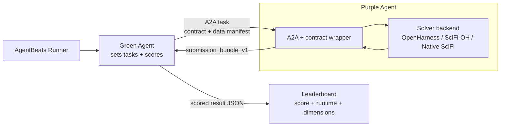
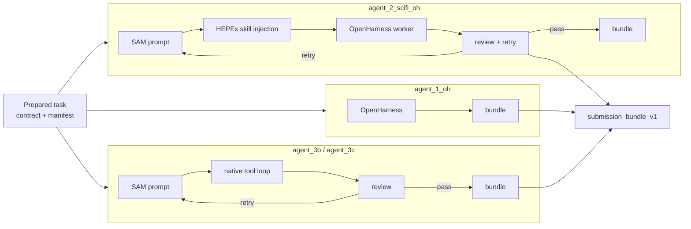

# HEPEx AnalysisOps Agents

This repository contains the reference AgentBeats Purple Agent for HEPEx
AnalysisOps. It exposes an A2A-compatible participant endpoint, receives public
task requests from the HEPEx Green Agent, runs a selected solver backend, and
returns exactly one `submission_bundle_v1` JSON response.

## Summary





A common failure mode in LLM-based benchmark agents is treating the task as one large prompt and relying on the model to self-police the answer. This Purple Agent treats each Green request as a *contract to be fulfilled*. Before backend reasoning begins, the wrapper compiles the task into runtime context, submission-contract constraints, input-manifest evidence, selected backend/model metadata, and machine-checkable expectations.

The backend design combines [OpenHarness](https://github.com/HKUDS/OpenHarness) for the baseline executor path with **SciFi**, our team's scientific-agent workflow framework. The SciFi-style backends implement the same core ideas described in [SciFi: A Safe, Lightweight, User-Friendly, and Fully Autonomous Agentic AI Workflow for Scientific Applications](https://arxiv.org/abs/2604.13180): structured scientific tasks, explicit context and stopping criteria, iterative refinement, and autonomous tool execution. In this repository, those ideas are adapted to the AgentBeats Purple Agent boundary and the `submission_bundle_v1` contract.

### Why This Is Different

- **Contract-aware harness**: every task is compiled into explicit constraints and expected artifacts before execution.
- **Team-developed SciFi workflow control**: our SciFi backends use structured Context / Todo / Expect framing, tool execution, review, and retry for scientific tasks.
- **Task-conditioned skill use**: domain guidance is injected when the task and manifest call for it, not bundled blindly.
- **Independent review + bounded retry**: deterministic checks reduce reliance on LLM self-grading and cap retry cost.
- **Stable external protocol**: OpenHarness, SciFi-OH, and native SciFi backends all return the same `submission_bundle_v1`.

### Backend Evaluation Status

Competition evidence for this agent is recorded in the sibling leaderboard repo: 
[hepex-analysisops-leaderboard](https://github.com/hrzhao76/hepex-analysisops-leaderboard). 

We are still evaluating the backend tradeoffs rather than claiming a single universally best configuration. The leaderboard repo keeps this comparison explicit: scenario files select the backend and model, while [`duckdb_queries.json`](https://github.com/hrzhao76/hepex-analysisops-leaderboard/blob/main/duckdb_queries.json) reports score, runtime, hard-check status, solver model, judge model, and rubric dimensions from committed `results/*.json`.

Current result examples suggest different strengths:

- `agent_1_oh` is the reliability baseline and remains competitive on contract-following runs.
- `agent_2_scifi_oh` is our current preferred competition backend: it keeps OpenHarness as the mature executor, adds SciFi-style contract-aware planning, deterministic review, bounded retry, and injects task-conditioned HEPEx skills when the task and manifest call for them. In current competition workflows, it is our lower-risk recommended path because it keeps the mature OpenHarness executor while adding SciFi review, retry, and HEPEx skill injection.
- `agent_3b_scifi_native` tests whether the SciFi workflow can generalize without depending on OpenHarness, trading maturity for independence from the OpenHarness executor.
- `agent_3c_scifi_native` is the newer native SciFi-v2 path with shared-environment tools and compacting; it is still the most experimental backend.


We therefore treat backend choice as an evaluation variable, not a hidden implementation detail. The public protocol remains fixed: every backend must return the same `submission_bundle_v1`, and Green scoring is based on the materialized artifacts rather than on backend identity.


## Repository Role

This repo owns the participant side of the benchmark:

1. Receive an A2A message from the Green Agent.
2. Parse the task request payload.
3. Load any runtime input manifest supplied by the Green Agent.
4. Build the final solver prompt with public contract and runtime context.
5. Select a solver backend and solver model.
6. Run the backend in the task work directory.
7. Return one text artifact containing the final `submission_bundle_v1` JSON.

The Purple Agent does not score submissions. Scoring belongs to the Green Agent.

## Public Request Contract

The Green Agent sends a JSON task payload with:

```json
{
  "role": "task_request",
  "task_id": "t002_hyy_v5_l1",
  "task_type": "hyy_l1",
  "mode": "call_white",
  "level": "l1",
  "solver_backend": "agent_2_scifi_oh",
  "solver_model": "gpt-5.4",
  "prompt": "...",
  "submission_contract": {},
  "data": {
    "input_strategy": "shared_manifest",
    "shared_input_dir": "/home/agent/output/shared_input/2025e-13tev-beta/data/GamGam",
    "input_manifest_path": "/home/agent/output/shared_input/2025e-13tev-beta/data/GamGam/input_manifest.json",
    "work_dir": "/home/agent/output/runs/<run_id>/<task_id>/solver_work",
    "output_dir": "/home/agent/output/runs/<run_id>/<task_id>/solver_work",
    "read_only_for_solver": true
  },
  "constraints": {
    "response_format": "submission_bundle_v1",
    "allow_purple_network": false
  }
}
```

The Purple Agent must return:

```json
{
  "status": "ok",
  "artifacts": {
    "canonical_filename.json": {},
    "canonical_filename.md": "markdown text"
  }
}
```

Do not wrap the final JSON in Markdown fences. Artifact keys must match the
Green-supplied `submission_contract.required_outputs[*].canonical_filename`,
plus any declared optional outputs the backend chooses to include. Backend code
should not call the Green scorer or write leaderboard result files.

## Backend Matrix

Backends are selected from the request by checking, in order:

1. `payload.solver_backend`
2. `payload.solver_agent`
3. `payload.constraints.solver_backend`
4. `payload.constraints.solver_agent`
5. default `agent_1_oh`

The default execution model in code is `gpt-5`. Leaderboard scenario files often
pin `solver_model = "gpt-5.4"` so Green sends that model in the Purple request
payload.

| Backend | Aliases | Executor style | Retry env | Debug log | Competition use |
| --- | --- | --- | --- | --- | --- |
| `agent_1_oh` | `openharness`, `oh` | OpenHarness subprocess with backend-owned AGENTS prompt and skill pack | OpenHarness wrapper retries transient/empty timeout failures up to 5 attempts | `debug_oh_output.log` | Baseline reliability and comparison point. |
| `agent_2_scifi_oh` | `scifi_oh` | SciFi-style SAM prompt and deterministic review loop over an OpenHarness worker executor | `SCIFI_OH_MAX_RETRIES`, fallback `SCIFI_MAX_RETRIES`, default `2` | `debug_scifi_oh_output.log` | Contract-aware controller with bounded review/retry while retaining OpenHarness execution. |
| `agent_3a_scifi_native` | `agent_03a_scifi_native`, `scifi_native`, `native_scifi` | Native Python OpenAI-compatible model/tool loop with SciFi-style review | `SCIFI_NATIVE_MAX_RETRIES`, fallback `SCIFI_MAX_RETRIES`, default `2` | `debug_scifi_native_output.log` | Native SciFi worker without OpenHarness dependency. |
| `agent_3b_scifi_native` | `agent_03b_scifi_native`, `scifi_native_general`, `native_scifi_general` | General native model/tool loop with task-agnostic contract-driven prompt builder | `SCIFI_NATIVE_MAX_RETRIES`, fallback `SCIFI_MAX_RETRIES`, default `2` | `debug_scifi_native_output.log` | Main generality experiment; no task-specific deterministic fast path. |
| `agent_3c_scifi_native` | `agent_03c_scifi_native`, `scifi_native_v2`, `native_scifi_v2` | Native SciFi loop aligned with `dev_max_bench_v2` SAM style, shared-env tools, and compacting | `SCIFI_NATIVE_MAX_RETRIES`, fallback `SCIFI_MAX_RETRIES`, default `2` | `debug_scifi_native_output.log` | V2 SciFi runtime experiment with environment discovery and activation tools. |

The unsuffixed names `agent_2_scifi` and `scifi` are intentionally not
registered; they are reserved for a future closer-to-upstream SciFi backend.

## Results And Query Evidence

The leaderboard repo is the evidence layer for AgentBeats competition review.
It does not change this agent's code, but it records scenario choices and
committed result JSON.

`../hepex-analysisops-leaderboard/duckdb_queries.json` defines two scoreboards:

- Hyy tasks: `t002_hyy_v5_l1`, `t003_hyy_v5_l2`, `t004_hyy_v5_l3`
- HZZ4l tasks: `t005_hzz4l_l1`, `t006_hzz4l_l2`, `t007_hzz4l_l3`

Those queries expose the participant id, task id, level, backend, normalized
score, Purple runtime seconds, solver model, judge model, status, hard-check
status, and six rubric dimensions: execution, pipeline, implementation,
reasoning, analysis, and validation.

Current committed result examples include Hyy and HZZ4l runs across
`agent_1_oh`, `agent_2_scifi_oh`, and `agent_3b_scifi_native`. Treat these as
point-in-time examples from `results/*.json`, not immutable leaderboard claims.
The scenario files under `ci-submit/` are the preferred reproducible reference
for backend comparisons because they pin task family, model, input mode, file
caps, and solver backend.

## Fair Play And Generality

The agent is designed to solve from the Green-provided prompt, public contract,
and runtime input manifest. It should not use hardcoded answers, private task
lookup tables, or benchmark exploits. The deterministic reviewer checks artifact
shape, schema fields, trace consistency, and unsupported scientific claims
before returning the final bundle in SciFi-style backends.

Generality is supported by the stable bundle interface and backend abstractions:
task-specific behavior should come from the Green task prompt, public contract,
manifest, and backend-owned reusable skills rather than from answer-specific
shortcuts. Tests also assert that native SciFi workers do not contain a
task-specific Hyy L1 fast path.

## Architecture

```text
src/server.py
  A2A HTTP server

src/executor.py
  A2A executor adapter

src/agent.py
  Transport-facing Purple Agent:
  - parse message
  - prepare bundle prompt
  - select solver backend
  - emit A2A statuses and final artifact

src/solver_backends.py
  Solver backend registry, model resolution, retry handling, output recovery,
  debug logging, and backend progress status

src/bundle_runtime.py
  Request parsing, input manifest loading, deterministic mock bundle helpers

src/agent_01_oh/
  Backend-owned OpenHarness assets:
  - AGENTS.md system prompt
  - sm-ana-aod OpenHarness skills submodule

src/agent_02_scifi_oh/
  Backend-owned SciFi-OH assets:
  - AGENTS.md worker/reviewer prompt
  - prompt_builder.py SAM prompt renderer
  - review.py deterministic bundle and trace review
  - loop.py bounded Prescan -> Work -> Independent Review loop
  - skills/ small text skills for contract review, Hyy, MC weighting, ROOT, and evidence checks

src/agent_03a_scifi_native/
  Backend-owned native SciFi assets for step 03a

src/agent_03b_scifi_native/
  Backend-owned general native SciFi assets for step 03b

src/agent_03c_scifi_native/
  Backend-owned native SciFi v2 assets with shared-env and compact-tool guidance
```

## Model Resolution

The backend reads model overrides from the request in this order:

1. `payload.solver_model`
2. `payload.solver_llm_model`
3. `payload.constraints.solver_model`
4. `payload.constraints.solver_llm_model`
5. default `gpt-5`

OpenHarness backends receive `HEPEX_AGENT_MODEL`, `HEPEX_OPENAI_MODEL`, and
`OPENHARNESS_MODEL`. Native SciFi backends also set `SCIFI_NATIVE_MODEL` when a
request model is provided. Scenario files in the leaderboard repo pin
`solver_model = "gpt-5.4"` for current competition runs; participant environment
variables alone are not enough because the Green Agent includes `solver_model`
in the Purple request payload.

## Development Setup

Prerequisites:

- `uv`
- Docker, for container testing
- `OPENAI_API_KEY` for OpenHarness or OpenAI-compatible native runs
- Git submodules for the OpenHarness skill pack

Initialize the OpenHarness skill pack:

```bash
git submodule update --init --recursive
```

Install dependencies:

```bash
uv sync
```

Run the focused local tests:

```bash
uv run pytest tests/test_submission_bundle_agent.py \
  tests/test_scifi_oh_backend.py \
  tests/test_scifi_native_backend.py \
  -q
```

Run the agent locally:

```bash
export OPENAI_API_KEY="..."
uv run src/server.py --host 0.0.0.0 --port 9009
```

Build the Docker image:

```bash
docker build -t hepex-purple-agent:local .
```

Run the container:

```bash
docker run --rm -p 9009:9009 \
  -e OPENAI_API_KEY="$OPENAI_API_KEY" \
  -v "$PWD/../hepex-analysisops-leaderboard/output:/home/agent/output" \
  hepex-purple-agent:local \
  --host 0.0.0.0 --port 9009 --card-url http://localhost:9009
```

Local project dependencies require Python `>=3.13` in `pyproject.toml`. The
Dockerfile currently installs the app through `uv`; use the Docker build as the
source of truth for container behavior.

## Local Full-Data E2E

The preferred way to test this Purple Agent against the Green Agent is from the
leaderboard repository:

```bash
cd ../hepex-analysisops-leaderboard
python3 scripts/local_shared_submit.py \
  --host-input-dir ../hepex-analysisops-benchmark/shared_input/2025e-13tev-beta/data/GamGam \
  --task-id t002_hyy_v5_l1 \
  --max-files 5 \
  --mode call_white \
  --solver-backend agent_2_scifi_oh \
  --build-local-images \
  --submission-prefix scifi-oh-hyy-local
```

That wrapper can build this repo's Docker image, build the Green Agent image,
mount local ROOT files into both containers, run Compose, archive
`output/results.json`, record provenance, and prepare local-only result files.
For CI-style backend comparisons, use
`../hepex-analysisops-leaderboard/ci-submit/*.toml`.

## Runtime Observability

The Purple Agent emits A2A working statuses for:

- parsed task id, task type, mode, and solver backend
- submission contract output list
- input manifest file count and size
- solver work directory
- backend attempt start/end
- independent review pass/fail and retry status for SciFi-style backends
- stdout/stderr character counts for OpenHarness-backed execution
- final bundle status and artifact list

Backend debug logs are written under the task work directory:

```text
<solver_work>/debug_oh_output.log           # agent_1_oh / openharness / oh
<solver_work>/debug_scifi_oh_output.log     # agent_2_scifi_oh / scifi_oh
<solver_work>/debug_scifi_native_output.log # agent_3a/3b/3c native SciFi backends
```

The backend may also create analysis scripts, plots, and logs under the same
`solver_work` directory. Those files are useful for local debugging but are not
the public submission interface.

## Environment Variables

| Variable | Required | Description |
| --- | --- | --- |
| `OPENAI_API_KEY` | yes for real OpenAI-backed runs | API key used by OpenHarness or native OpenAI-compatible workers. |
| `OPENAI_BASE_URL` | no | Generic OpenAI-compatible base URL fallback for native workers. |
| `HEPEX_AGENT_MODEL` | no | Solver model fallback used by OpenHarness and native workers. |
| `HEPEX_OPENAI_MODEL` | no | Additional solver model fallback. |
| `OPENHARNESS_MODEL` | no | OpenHarness model setting. |
| `HEPEX_SOLVER_WORK_DIR` | set by backend | Per-task solver working directory. |
| `HEPEX_OUTPUT_DIR` | set by backend | Alias for the solver output directory. |
| `SCIFI_OH_MAX_RETRIES` | no | Maximum SciFi-OH worker attempts for `agent_2_scifi_oh`; default `2`. |
| `SCIFI_MAX_RETRIES` | no | Shared fallback retry count for SciFi-style backends. |
| `SCIFI_NATIVE_MODEL` | no | Native SciFi model override; request `solver_model` takes precedence when provided. |
| `SCIFI_NATIVE_API_KEY` | no | Native SciFi API key override. |
| `SCIFI_NATIVE_BASE_URL` | no | Native SciFi OpenAI-compatible base URL override. |
| `SCIFI_NATIVE_MAX_ITERATIONS` | no | Max model/tool loop iterations per native worker attempt; default `30`. |
| `SCIFI_NATIVE_MAX_BASH_SECONDS` | no | Max seconds for one native bash tool call; default `300`. |
| `SCIFI_NATIVE_MAX_TOOL_CHARS` | no | Max characters retained from one native tool result; default `12000`. |
| `SCIFI_NATIVE_TOOL_LOG_CHARS` | no | Max characters written from one tool result into debug logs; default `4000`. |
| `SCIFI_NATIVE_SHARED_ENV_ROOT` | no | Shared environment root for v2 native tools; default `/mnt/sci_envs`. |
| `SCIFI_NATIVE_MAX_RETRIES` | no | Maximum native SciFi independent-review attempts; default `2`. |

## Common Failure Modes

- `Unknown solver_backend`: Green requested a backend name that is not
  registered in `src/solver_backends.py`.
- Missing input manifest: mock bundle requests require
  `data.input_manifest_path`; real shared-manifest requests should receive it
  from Green.
- Unexpected artifact names: the returned bundle contains files not declared by
  the Green-supplied submission contract.
- Missing required artifact names: the returned bundle omitted one or more
  `submission_contract.required_outputs[*].canonical_filename` entries.
- Oversized or non-JSON bundle: `submission_bundle_v1` is a small structured
  envelope, not a bulk artifact channel.
- Empty OpenHarness stdout: backend returns a structured error bundle and may
  retry if stderr looks transient.
- Native worker API configuration failure: check `OPENAI_API_KEY`,
  `SCIFI_NATIVE_API_KEY`, `OPENAI_BASE_URL`, and `SCIFI_NATIVE_BASE_URL`.
- Output contract failure: inspect the Green run directory, especially
  `purple_request.json`, `purple_response_raw.txt`, `submission_bundle_raw.json`,
  and `judge_output.json`.

## Adding A Backend

1. Add backend-owned assets under `src/agent_<nn>_<name>/`.
2. Add a class implementing the `SolverBackend` protocol in
   `src/solver_backends.py`.
3. Implement `run(prompt, req_json, system_prompt, status, input_manifest,
   work_dir) -> str`.
4. Register explicit names and aliases in `_BACKENDS`.
5. Add tests in `tests/test_submission_bundle_agent.py`,
   `tests/test_scifi_oh_backend.py`, or `tests/test_scifi_native_backend.py`.
6. Run `uv run pytest -q`.


## License

See `LICENSE`.